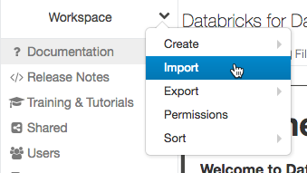

# Run benchmark notebooks for performance comparisons

###  Import the notebooks
You should import the **notebook**  we provided to Workspace to run benchmark notebooks.

1. Download the notebooks: BERT-Large benchmark for TensorFlow and **[benchmark_sklearn.ipynb](./benchmark_sklearn.ipynb)** to your local folder.
2. Click the  **Workspace** icon or the  **Home** icon in the left sidebar.
3. Click **Down** caret in the Workspace or a user folder and select Import. 

4. Browse to the notebook files downloaded to the local folder.
5. Click **Import**.

### Run benchmark notebooks
#### Run benchmark_sklearn notebook
 1. Create cluster with Databricks ML Runtime or Databricks ML Runtime with Intel Optimized ML libraries as described above. For the Node type, we recommend to use **Standard_F16s_v2** or **Standard_F32s_v2**.
 2. Open the notebook *benchmark_sklearn* and attach it to the corresponding cluster you created.
 3. Click **Run All**.
   
#### Run BERT-Large benchmark notebooks for TensorFlow
 1. Create cluster with Databricks ML Runtime or Databricks ML Runtime with Intel Optimized ML libraries as described above. For the Node type, we recommend to use **Standard_F32s_v2**.
 2. Open the notebook *benchmark_tensorflow_bertlarge_preparation*, *benchmark_tensorflow_bertlarge_training* and *benchmark_tensorflow_bertlarge_inference*, then attach them to the corresponding cluster you created.
 3. Run *benchmark_tensorflow_preparation* for downloading datasets, checkpoints and models.
 4. Run BERT-Large benchmark workload.
 - Run *benchmark_tensorflow_bertlarge_training* for running training workload.
 - Run *benchmark_tensorflow_bertlarge_inference* for running inference workload.
