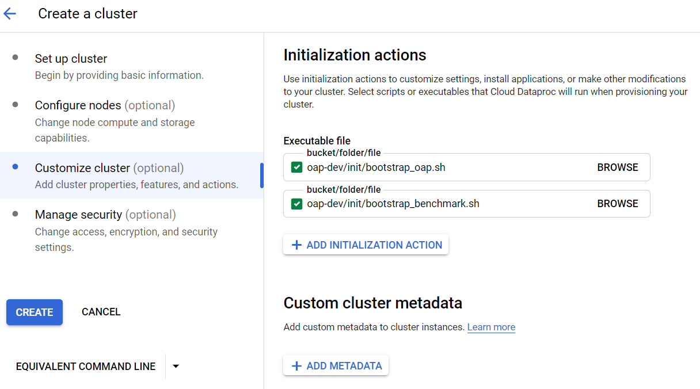

# Gazelle on GCP Dataproc 2.0

## 1. Creating a cluster on Dataproc 2.0

### 1.1 Uploading initialization actions

Upload the initialization actions scripts to Cloud Storage bucket. 
**[bootstrap_oap.sh](../bootstrap_oap.sh)** is to help conda install OAP packages and
**[bootstrap_benchmark.sh](./bootstrap_benchmark.sh)** is to help install necessary tools for TPC-DS, TPC-H and HIBench on Dataproc clusters.
    
1). Download **[bootstrap_oap.sh](../bootstrap_oap.sh)** and **[bootstrap_benchmark.sh](./bootstrap_benchmark.sh)** to a local folder.

2). Upload these scripts to bucket.


### 1.2 Create a new cluster with initialization actions

To create a new cluster with initialization actions, follow the steps below:

1). Click the  **CREATE CLUSTER** to create and custom your cluster.

2). **Set up cluster:** choose cluster type and Dataproc image version `2.0-centos8`, enable component gateway.


3). **Configure nodes:** choose the instance type and other configurations of nodes.

4). **Customize cluster:** add initialization actions as below;


5). **Manage security:** define the permissions and other security configurations;

6). Click **Create**. 

## 2. Configurations for enabling Gazelle

### 2.1. Creating a directory on HDFS 

```
$ hadoop fs -mkdir /spark-warehouse
```


### 2.2. Config to enable Gazelle

Modify `$SPARK_HOME/conf/spark-defaults.conf`. 

**[bootstrap_oap.sh](../bootstrap_oap.sh)** will help install all OAP packages under dir `/opt/benchmark-tools/oap`,
make sure to add below configuration to `spark-defaults.conf`.

```
spark.driver.extraLibraryPath                /opt/benchmark-tools/oap/lib
spark.executorEnv.LD_LIBRARY_PATH            /opt/benchmark-tools/oap/lib
spark.executor.extraLibraryPath              /opt/benchmark-tools/oap/lib
spark.executorEnv.LIBARROW_DIR               /opt/benchmark-tools/oap
spark.executorEnv.CC                         /opt/benchmark-tools/oap/bin/gcc
```
Then make sure use below command to add some environment variables before start Gazelle, you can also add them to `~/.bashrc`.
```
export CC=/opt/benchmark-tools/oap/bin/gcc
export LIBARROW_DIR=/opt/benchmark-tools/oap
export LD_LIBRARY_PATH=/opt/benchmark-tools/oap/lib/:$LD_LIBRARY_PATH
```


Here is an example of `spark-defaults.conf` on a `1 master + 2 workers` Dataproc cluster.

```
###Enabling Gazelle Plugin###

spark.driver.extraLibraryPath                /opt/benchmark-tools/oap/lib
spark.executorEnv.LD_LIBRARY_PATH            /opt/benchmark-tools/oap/lib
spark.executor.extraLibraryPath              /opt/benchmark-tools/oap/lib
spark.executorEnv.LIBARROW_DIR               /opt/benchmark-tools/oap
spark.executorEnv.CC                         /opt/benchmark-tools/oap/bin/gcc

spark.sql.extensions  com.intel.oap.ColumnarPlugin
spark.files   /opt/benchmark-tools/oap/oap_jars/spark-columnar-core-<version>-jar-with-dependencies.jar,/opt/benchmark-tools/oap/oap_jars/spark-arrow-datasource-standard-<version>-jar-with-dependencies.jar
spark.driver.extraClassPath  /opt/benchmark-tools/oap/oap_jars/spark-columnar-core-<version>-jar-with-dependencies.jar:/opt/benchmark-tools/oap/oap_jars/spark-arrow-datasource-standard-<version>-jar-with-dependencies.jar
spark.executor.extraClassPath  /opt/benchmark-tools/oap/oap_jars/spark-columnar-core-<version>-jar-with-dependencies.jar:/opt/benchmark-tools/oap/oap_jars/spark-arrow-datasource-standard-<version>-jar-with-dependencies.jar

spark.master yarn
spark.deploy-mode client
spark.executor.instances 4
spark.executor.cores 2
spark.executor.memory 4g
spark.executor.memoryOverhead 2989
spark.memory.offHeap.enabled false
spark.memory.offHeap.size 3g
spark.driver.memory 2g
spark.driver.maxResultSize  3g

spark.shuffle.manager     org.apache.spark.shuffle.sort.ColumnarShuffleManager
spark.oap.sql.columnar.sortmergejoin  true
spark.oap.sql.columnar.preferColumnar true
spark.oap.sql.columnar.joinOptimizationLevel 12

spark.sql.warehouse.dir hdfs://cluster-dev-m/spark-warehouse
spark.sql.autoBroadcastJoinThreshold 31457280
spark.sql.adaptive.enabled true
spark.sql.inMemoryColumnarStorage.batchSize 20480
spark.sql.sources.useV1SourceList avro
spark.sql.extensions com.intel.oap.ColumnarPlugin
spark.sql.columnar.window  true
spark.sql.columnar.sort  true
spark.sql.execution.arrow.maxRecordsPerBatch 20480
spark.sql.shuffle.partitions  72
spark.sql.parquet.columnarReaderBatchSize 20480
spark.sql.columnar.codegen.hashAggregate false
spark.sql.join.preferSortMergeJoin  false
spark.sql.broadcastTimeout 3600

spark.authenticate false
spark.history.ui.port 18080
spark.history.fs.cleaner.enabled true
spark.eventLog.enabled true
spark.network.timeout 3600s
spark.serializer org.apache.spark.serializer.KryoSerializer
spark.kryoserializer.buffer           64m
spark.kryoserializer.buffer.max       256m
spark.dynamicAllocation.executorIdleTimeout 3600s

```

## 3. Run TPC-DS with benchmark-tools

### 3.1. Update the basic configuration of spark

#### Update the basic configuration of spark
```
$ sudo cp /lib/spark/conf/spark-defaults.conf ./repo/confs/spark-oap-dataproc/spark/spark-defaults.conf
```

### 3.2. Create the testing repo && Config gazelle_plugin

#### Create the testing repo
```
mkdir ./repo/confs/gazelle_plugin_performance
```
#### Update the content of .base to inherit the configuration of ./repo/confs/spark-oap-emr
```
echo "../spark-oap-dataproc" > ./repo/confs/gazelle_plugin_performance/.base
```
#### Update the content of ./repo/confs/gazelle_plugin_performance/env.conf
```
NATIVE_SQL_ENGINE=TRUE
STORAGE=s3
S3_BUCKET={bucket_name}
```
Note: If you want to use s3 for storage, you must define S3_BUCKET; 
If you use HDFS for storage, you should set STORAGE like below:

```
STORAGE=hdfs
```

#### Define the configurations of TPC-DS

Edit the content of `./repo/confs/gazelle_plugin_performance/TPC-DS/config`

```
scale 1                    // data scale/GB
format parquet             // support parquet or orc
partitionTables true       // creating partitioned tables
queries all                // 'all' means running 99 queries, '1,2,4,6' means running q1.sql, q2.sql, q4.sql, q6.sql
```

#### Define the configurations of TPC-H

Edit the content of `./repo/confs/gazelle_plugin_performance/TPC-H/config`
```
scale 1                    // data scale 1 GB
format parquet             // support parquet or orc
partitionTables true       // creating partitioned tables
queries all                // 'all' means running 22 queries, '1,2,4,6' means running 1.sql, 2.sql, 4.sql, 6.sql
```

### 3.3. Run TPC-DS

We provide scripts to help easily run TPC-DS and TPC-H.

```
###Update: 
bash bin/tpc_ds.sh update ./repo/confs/gazelle_plugin_performance   

###Generate data: 
bash bin/tpc_ds.sh gen_data ./repo/confs/gazelle_plugin_performance

### run power test for 1 round.

bash bin/tpc_ds.sh run ./repo/confs/gazelle_plugin_performance 1
```

### 3.4. Run TPC-H:  

```
Update: bash bin/tpc_h.sh update ./repo/confs/gazelle_plugin_performance   

bash bin/tpc_h.sh gen_data ./repo/confs/gazelle_plugin_performance

### run power test for 1 round.
bash bin/tpc_h.sh run ./repo/confs/gazelle_plugin_performance 1
```
