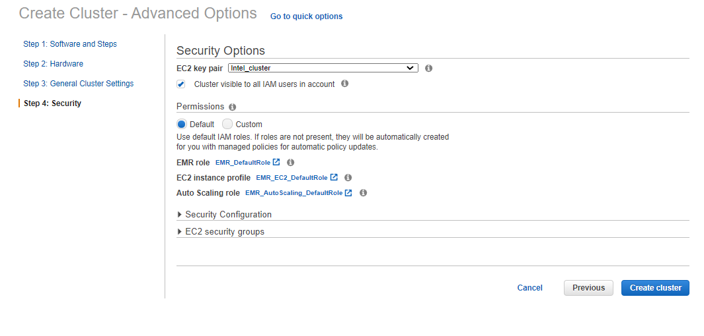

# Use OAP on Amazon EMR cloud

## 1. Upload init script 

Upload the init script **[bootstrap_oap.sh](./bootstrap_oap.sh)** to S3:
    
1. Download **[bootstrap_oap.sh](./bootstrap_oap.sh)** to a local folder.
2. Update **[bootstrap_oap.sh](./bootstrap_oap.sh)** to S3.

## 2. Create a new cluster using bootstrap script
To create a new cluster using the uploaded bootstrap script, follow the following steps:

1. Click the  **Go to advanced options** to custom your cluster;
2. **Software and Steps:** choose the release of emr and the software you need;
3. **Hardware:** choose the instance type and other configurations of hardware;
4. **General Cluster Settings:** add **[bootstrap_oap.sh](./bootstrap_oap.sh)** (install OAP binary) and **[install_benchmark.sh](./install_benchmark.sh)** (install tpcds-kit, tpch-dbgen, spark-sql-perf, HiBench etc..) like following picture;

5. **Security:** define the permissions and other security configurations;
6. Click **Create cluster**. 

## 3. Run various workloads easily by using notebooks or benchmark tool

### 3.1 Using notebooks
You can visit the [Notebooks User Guide](./notebooks/README.md) to learn how to use notebooks to easily generate data and run TPC-DS with gazelle_plugin.

### 3.2 Using benchmark tool
You can visit the [Benchmark tool User Guide](./benchmark/README.md) to learn how to use benchmark tool to easily run TPC-DS, TPC-H and HiBench with OAP.
