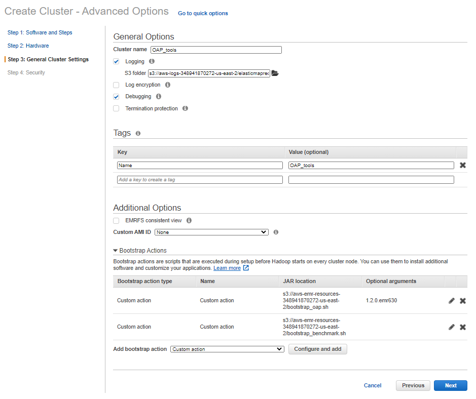

# Intel-MLlib on EMR 6.3.0

## 1. Create a new cluster

To run bencbmark on EMR cluster, you need upload both **[bootstrap_benchmark.sh](../benchmark/bootstrap_benchmark.sh)** and **[bootstrap_oap.sh](../bootstrap_oap.sh)** to S3 and add extra bootstrap action to execute **[bootstrap_benchmark.sh](../benchmark/bootstrap_benchmark.sh)** and **[bootstrap_oap.sh](../bootstrap_oap.sh)** when creating a new cluster.


 

## 2. Using benchmark-tools to easily run K-means, PCA and ALS with Intel-MLlib

You can refer to [benchmark-tool Guide](../../benchmark-tool/README.md) to learn how to use this tool. We switch working directory at ```../../benchmark-tool``` and follow next steps.

### 2.1. Update the basic configuration of spark

#### Update the basic configuration of spark
```
$ sudo cp /lib/spark/conf/spark-defaults.conf ./repo/confs/spark-oap-emr/hibench/spark.conf;
```

### 2.2. Create the testing repo && Config Intel-MLlib

#### Create the testing repo
```
mkdir ./repo/confs/Intel_MLlib_performance
```
#### Update the content of .base to inherit the configuration of ./repo/confs/spark-oap-emr
```
echo "../spark-oap-emr" > ./repo/confs/Intel_MLlib_performance/.base
```
#### Update the content of ./repo/confs/Intel_MLlib_performance/env.conf
```
STORAGE=s3
S3_BUCKET={bucket_name}
```
Note: If you want to use s3 for storage, you must define S3_BUCKET; if you use hdfs for storage, you should set STORAGE like ```STORAGE=hdfs```

#### Update the configurations of spark
**[bootstrap_oap.sh](../bootstrap_oap.sh)** will help install all OAP packages under dir `/opt/benchmark-tools/oap`,
make sure to add below configuration to `./repo/confs/Intel_MLlib_performance/hibench/spark.conf`.

```
++spark.driver.extraLibraryPath             :/opt/benchmark-tools/oap/lib
++spark.driver.extraClassPath               :/opt/benchmark-tools/oap/oap_jars/oap-mllib-1.2.0.jar

++spark.executor.extraLibraryPath           :/opt/benchmark-tools/oap/lib
++spark.executor.extraClassPath             :/opt/benchmark-tools/oap/oap_jars/oap-mllib-1.2.0.jar

spark.executor.extraJavaOptions             -XX:+UseG1GC -verbose:gc -XX:+PrintGCDetails -XX:+PrintGCTimeStamps

spark.executor.memoryOverhead               512m     # Make it enough to cache training data
hibench.yarn.executor.num                   2        # Refer to the default value of spark.executor.cores of /lib/spark/conf/spark-defaults.conf
hibench.yarn.executor.cores                 2        # Divide the sum of vcores by hibench.yarn.executor.num

spark.default.parallelism                   4        # Equal to the sum of vcores
spark.sql.shuffle.partitions                4        # Equal to the sum of vcores
```
Note: "++" means to append the value of spark to the end of original value.

#### Define te the configurations of hibench.conf

Edit the content of `./repo/confs/Intel_MLlib_performance/hibench/hibench.conf` to change the 
```
hibench.scale.profile                       tiny     # Support tiny, small, large, huge, gigantic, bigdata.
```

#### Define the configurations of kmeans.conf

Edit the content of `./repo/confs/Intel_MLlib_performance/hibench/kmeans.conf`
```
hibench.kmeans.tiny.num_of_clusters         5
hibench.kmeans.tiny.dimensions              3
hibench.kmeans.tiny.num_of_samples          30000
hibench.kmeans.tiny.samples_per_inputfile   6000
hibench.kmeans.tiny.max_iteration           5
hibench.kmeans.tiny.k                       10
hibench.kmeans.tiny.convergedist            0.5
```
Note: You can use default value of kmeans.conf and no need to change any values. If you want to change the parameters of K-means, you need to modify the value of the corresponding scale profile.

#### Define the configurations of pca.conf

Edit the content of `./repo/confs/Intel_MLlib_performance/hibench/pca.conf`
```
hibench.pca.tiny.examples                   10
hibench.pca.tiny.features                   10
hibench.pca.tiny.k                          3
hibench.pca.tiny.maxresultsize              "1g"
```
Note: You can use default value of pca.conf and no need to change any values. If you want to change the parameters of PCA, you need to modify the value of the corresponding scale profile.

#### Define the configurations of als.conf

Edit the content of `./repo/confs/Intel_MLlib_performance/hibench/pca.conf`
```
hibench.als.tiny.users                     100
hibench.als.tiny.products                  100
hibench.als.tiny.ratings                   200
hibench.als.tiny.implicitprefs	           true
```
Note: You can use default value of als.conf and no need to change any values. If you want to change the parameters of ALS, you need to modify the value of the corresponding scale profile.

### 2.3. Run K-means

```
Update: bash bin/hibench.sh update ./repo/confs/Intel_MLlib_performance   

Generate data: bash bin/hibench.sh gen_data ./repo/confs/Intel_MLlib_performance ml/kmeans

Run benchmark: bash bin/hibench.sh run ./repo/confs/Intel_MLlib_performance ml/kmeans
```

### 2.4. Run PCA:  

```
Update: bash bin/hibench.sh update ./repo/confs/Intel_MLlib_performance   

Generate data: bash bin/hibench.sh gen_data ./repo/confs/Intel_MLlib_performance ml/pca

Run benchmark: bash bin/hibench.sh run ./repo/confs/Intel_MLlib_performance ml/pca
```

### 2.4. Run ALS:  

```
Update: bash bin/hibench.sh update ./repo/confs/Intel_MLlib_performance   

Generate data: bash bin/hibench.sh gen_data ./repo/confs/Intel_MLlib_performance ml/als

Run benchmark: bash bin/hibench.sh run ./repo/confs/Intel_MLlib_performance ml/als
```
