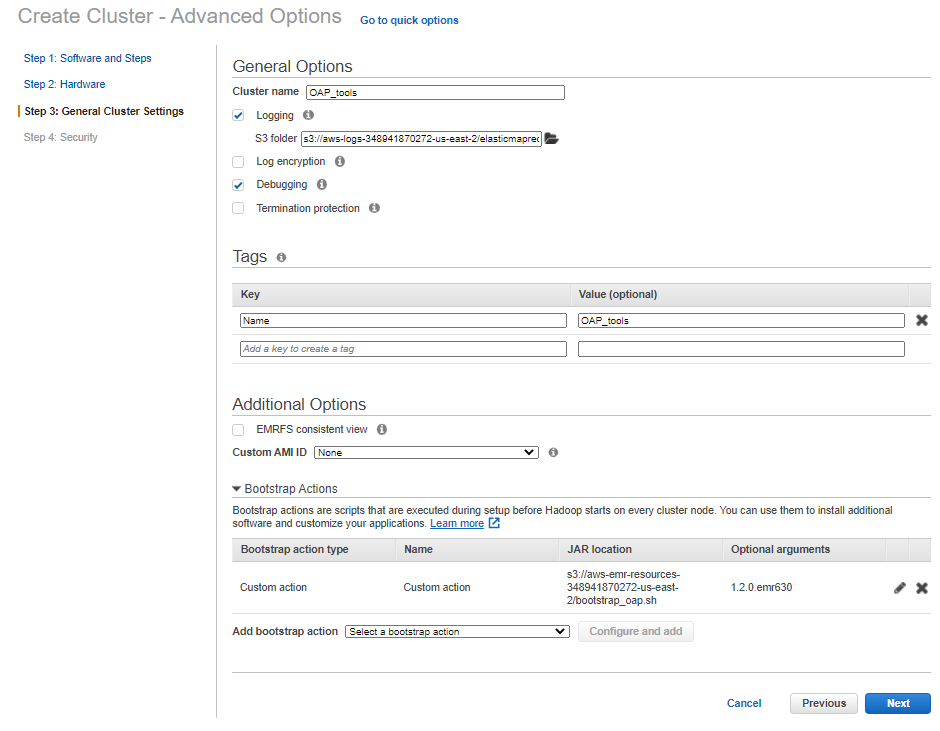

# Using notebooks to run TPC-DS

## 1. Upload init script 

Upload the init script **[bootstrap_oap.sh](../bootstrap_oap.sh)** to S3:
    
1. Download **[bootstrap_oap.sh](../bootstrap_oap.sh)** to a local folder.
2. Update **[bootstrap_oap.sh](../bootstrap_oap.sh)** to S3.


## 2. Create a new cluster using bootstrap script
To create a new cluster using the uploaded bootstrap script, follow the following steps:

1. Click the  **Go to advanced options** to custom your cluster;
2. **Software and Steps:** choose the release of emr and the software you need;
3. **Hardware:** choose the instance type and other configurations of hardware;
4. **General Cluster Settings:** add **[bootstrap_oap.sh](../bootstrap_oap.sh)** (install OAP binary) and **[install_benchmark.sh](../install_benchmark.sh)** (install tpcds-kit, tpch-dbgen, spark-sql-perf, HiBench etc..) like following picture;

5. **Security:** define the permissions and other security configurations;
6. Click **Create cluster**. 


## 3. Generate data
You need to update the following configurations according to your request on **[tpcds_datagen.ipynb](./tpcds_datagen.ipynb)**:
```
val scale = "1"                   // data scale 1GB
val format = "parquet"            // support parquer or orc
val partitionTables = true        // create partitioned table
val storage = "s3"                // support hdfs or s3
var bucket_name = "aws-emr-resources-348941870272-us-east-2"   // when storage is "s3", this value will be use.
val useDoubleForDecimal = false   // use double format instead of decimal format
```
Then you can use **[tpcds_datagen.ipynb](./tpcds_datagen.ipynb)** to generate data.

## 4. Run TPC-DS power test
You need to update the following configurations according to your request on **[tpcds_power_test.ipynb](./tpcds_power_test.ipynb)**:
```
val scaleFactor = "1"             // data scale 1GB
val iterations = 1                // how many times to run the whole set of queries.
val format = "parquet"            // support parquer or orc
val storage = "s3"                // support hdfs or s3
var bucket_name = "aws-emr-resources-348941870272-us-east-2"   // when storage is "s3", this value will be use.
val use_arrow = true              // when you want to use gazella_plugin to run TPC-DS, you need to set it true.
val partitionTables = true        // create partition tables
val query_filter = Seq()          // Seq() == all queries
//val query_filter = Seq("q1-v2.4", "q2-v2.4") // run subset of queries
val randomizeQueries = false      // run queries in a random order. Recommended for parallel runs.
```
Note: If we want to use gazelle_plugin, we need to use the second cell to start a new spark session and the value of `use_arrow` should be `true`. If we want to run TPC-DS with vanilla spark, we should use the first cell to start a new spark session and the value of `use_arrow` should be `false`.

## 5. Run TPC-DS throughput test
You need to update the following configurations according to your request on **[tpcds_throughput_test.ipynb](./tpcds_throughput_test.ipynb)**:
```
val stream_num = 2                // how many streams you want to start 
val scaleFactor = "1"             // data scale 1GB
val iterations = 1                // how many times to run the whole set of queries.
val format = "parquet"            // support parquer or orc
val storage = "s3"                // support hdfs or s3
var bucket_name = "aws-emr-resources-348941870272-us-east-2"   // when storage is "s3", this value will be use.
val use_arrow = true              // when you want to use gazella_plugin to run TPC-DS, you need to set it true.
val partitionTables = true        // create partition tables
val query_filter = Seq()          // Seq() == all queries
//val query_filter = Seq("q1-v2.4", "q2-v2.4") // run subset of queries
val randomizeQueries = true       // run queries in a random order. Recommended for parallel runs.
```
Note: If we want to use gazelle_plugin, we need to use the second cell to start a new spark session and the value of `use_arrow` should be `true`. If we want to run TPC-DS with vanilla spark, we should use the first cell to start a new spark session and the value of `use_arrow` should be `false`.
